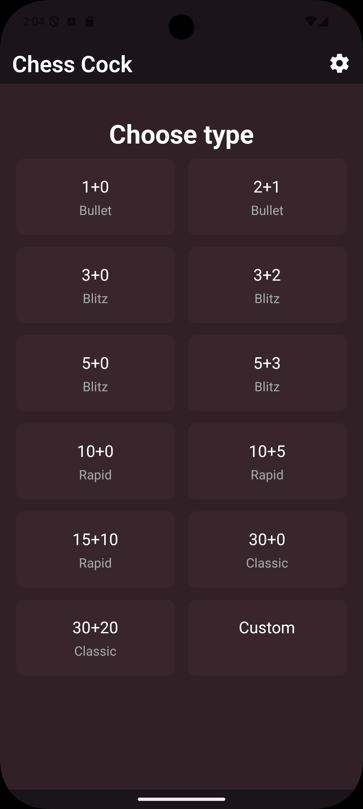
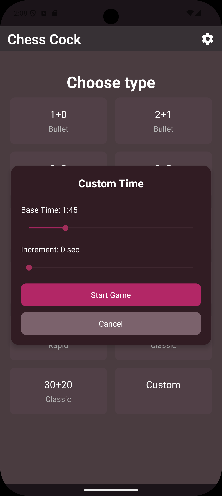
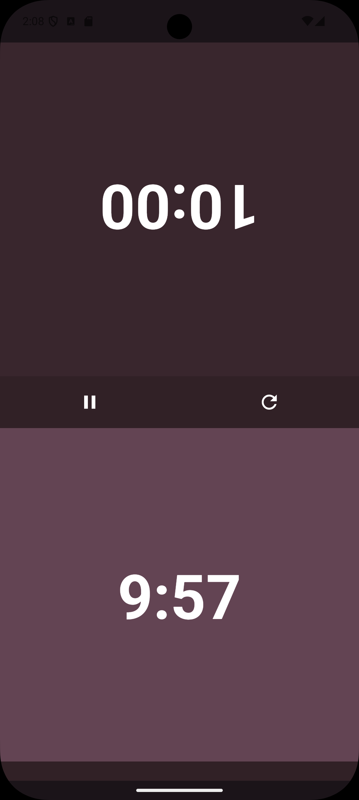

# Chess Clock (Expo + React Native)

A simple and lightweight chess clock built with **Expo**, **React Native**, and **TypeScript**.
This project demonstrates mobile app development concepts including timers, theming, state management, navigation, and persistent settings.

---

## Features

* Two-player chess clock
* Tap to switch turns
* Pause & resume
* Light & dark theme
* Persistent settings via AsyncStorage
* Sub-second display options
* Custom time formatting (tenths, hundredths, milliseconds)

---

## Prerequisites

* Node.js (LTS recommended)
* Expo CLI
* A smartphone with Expo Go
* Phone & computer on the same WiFi network

---

## Installation

### 1. Clone the repository

```bash
git clone https://github.com/yourusername/chess-clock.git
cd chess-clock
```

### 2. Install dependencies

```bash
yarn install
# or
npm install
```

### 3. Start the Expo development server

```bash
yarn start
# or
npm start
```

Scan the QR code using:

* iOS → Camera app
* Android → Expo Go app

---

##  Development Commands

```bash
yarn start         # Start dev server
yarn android       # Run Android emulator
yarn ios           # Run iOS simulator
yarn web           # Web version
yarn lint          # Run linting
yarn format        # Format code using Prettier
```

---

## Project Structure

```plaintext
app/
  index.tsx
  clock.tsx
  _layout.tsx

components/
  TimeDisplay.tsx
  TopBar.tsx

context/
  ThemeContext.tsx

hooks/
  useHaptics.ts
  useSettings.ts

constants/
  theme.ts
  settings.ts
  presets.ts
  timeSteps.ts

utils/
  formatTime.ts
```

---

## Troubleshooting

### App won't load?

1. Ensure both devices are on the same WiFi
2. Restart Metro bundler (`r`)
3. Hard clear Metro cache:

```bash
expo start --clear
```

4. Restart Expo Go app

### TypeScript errors with vector icons?

Create the file:

```
@types/react-native-vector-icons/index.d.ts
```

Add:

```ts
declare module "react-native-vector-icons/MaterialIcons";
```

---


## Screenshots of views and their basic use / features

### Main page:



1. Select from predetermined game presets
2. Select to make a custom game
3. Go to settings


### Custom game selection modal:



1. Set game time
2. Set game increment
3. Start the game or not


### Settings and preferences page:


1. Set Darkmode or lightmode
2. Set at what time to show the sub-second display via slider
3. Set a thew sub-second format to show
4. Set whether for the app to remember the last used custom game settings or not


## The chess clock



1. Switch which clock ticks down after making a move and tapping the highlighted, ticking down side
2. Reset the clock
3. Pause the clock
4. Pause the game and display red border on the side that runs out of time
